# PetNest+ AI Edition

## Original Project

**PawPal+** (Module 2) is a Streamlit app that helps a pet owner plan daily care tasks for their pet. It lets users enter owner and pet profiles, add care tasks with priority and duration, and generate a daily schedule using a greedy algorithm that sorts tasks by priority, preferred time of day, and duration, fitting them within the owner's available time budget. The original system also includes chronological sorting, completion-status filtering, scheduling conflict detection, and recurring task generation.

---

## Summary of PetNest

**PetNest+** extends the original scheduler with an agentic AI workflow powered by Google Gemini. Instead of requiring the owner to manually create every care task from scratch, the app now lets Gemini analyze the pet's profile and suggest a tailored list of tasks, which the owner reviews before adding. After the schedule is built, Gemini explains the final plan in plain English, highlighting what was included and why. The result is a three-step human-in-the-loop workflow: AI proposes → owner decides → AI explains.

---

## Architecture Overview

The system is organized into three layers:

1. **Business logic** — `petnest_system.py` defines five classes (`Owner`, `Pet`, `Task`, `Schedule`, `Scheduler`) that handle all scheduling, sorting, filtering, conflict detection, and recurring task logic independently of the UI.
2. **AI advisor** — `ai_advisor.py` defines `AIAdvisor`, which wraps the Gemini API. `suggest_tasks()` sends the pet's profile to Gemini and parses the JSON response into structured task dicts. `explain_schedule()` sends the finalized schedule back to Gemini for a plain-English summary.
3. **UI** — `app.py` is a Streamlit interface that wires the two layers together and holds all state in `st.session_state`.

### Agentic Workflow

```
┌──────────────────────────────────────────────────────────────────┐
│                            PetNest                               │
│                                                          TESTING │
│  [1] Owner enters pet profile + time budget                      │
│          │                                                       │
│          ▼                                                       │
│  AIAdvisor.suggest_tasks()  ──►  Gemini API                      │
│          │   returns JSON task list                              │
│          │                                                       │
│          ▼                                         ┌──────────┐  │
│  _validate_suggestion()  ◄── filters bad fields    │ logging  │  │
│          │   drops tasks missing required fields   │ (file)   │  │
│          │                                         └──────────┘  │
│          ▼                                                       │
│  Owner reviews & selects tasks  (human checkpoint)               │
│          │                                                       │
│          ▼                                                       │
│  Scheduler.generate_schedule()  (greedy fit)        ┌─────────┐  │
│          │   priority → time preference → duration  │ unit    │  │
│          │  ◄─────────────────────────────────────  │ tests   │  │
│          ▼                                          │ (pytest)│  │
│  Schedule displayed with per-task reasoning         └─────────┘  │
│          │                                                       │
│          ▼                                                       │
│  AIAdvisor.explain_schedule()  ──►  Gemini API                   │
│          │   returns plain-English explanation                   │
│          │                                          ┌──────────┐ │
│          │  ◄─────────────────────────────────────  │ mocked   │ │
│          ▼                                          │ API tests│ │
│  Owner reads explanation                            └──────────┘ │
└──────────────────────────────────────────────────────────────────┘
```

**Testing layer key:**
- **Unit tests (pytest)** — 13 tests validate `Scheduler` logic (sorting, recurrence, conflict detection). Run with `python -m pytest tests/test_petnest.py -v`.
- **Mocked API tests** — `tests/test_ai_advisor.py` uses `unittest.mock` to test `AIAdvisor` without a live key: valid JSON parsing, field validation filtering, code-fence stripping, and graceful error handling.
- **`_validate_suggestion()` (runtime guard)** — integrated into `suggest_tasks()`, filters out any AI-returned task missing required fields or containing invalid enum values before they reach the UI.
- **File logging** — `ai_advisor.py` writes every call, response length, parse error, and validation rejection to `petnest_advisor.log`.

### Class Diagram

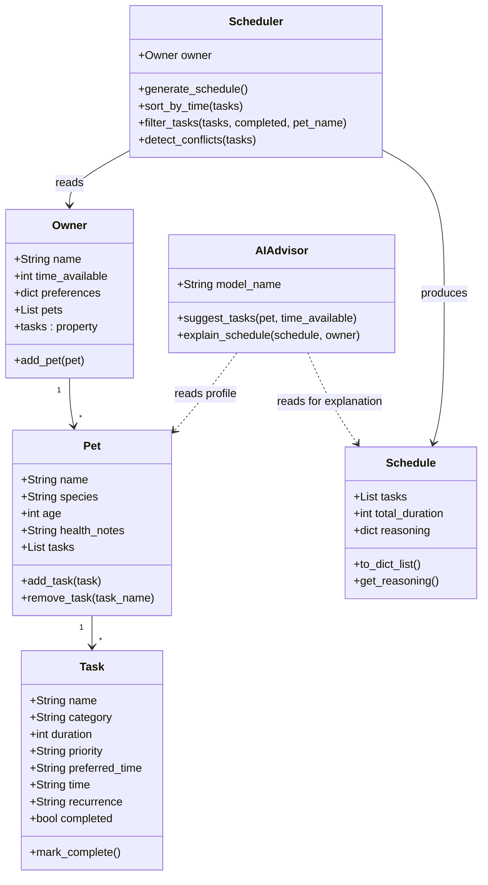

---

## Setup Instructions

**Requirements:** Python 3.9+, a free Google Gemini API key from [aistudio.google.com](https://aistudio.google.com).

```bash
# 1. Clone the repo
git clone https://github.com/lorraineC26/applied-ai-system-pawpal.git
cd applied-ai-system-pawpal

# 2. Create and activate a virtual environment
python -m venv .venv
source .venv/bin/activate        # Windows: .venv\Scripts\activate

# 3. Install dependencies
pip install -r requirements.txt

# 4. Run the app
streamlit run app.py
```

When the app opens, paste your Gemini API key in the **AI Settings** sidebar. The scheduler works without a key; AI suggestions and plan explanations require it.

**Run tests:**
```bash
python -m pytest tests/test_petnest.py -v
```

---

## Sample Interactions

Two complete sessions were run with different pets to exercise the full agentic workflow: AI suggestion → owner review → schedule generation → AI explanation.

---

### Example 1 — Kiki the Cat 🐈‍⬛ (2 years old)

**Step 1 — Enter profile and API key.** The owner fills in Kiki's profile (species, age, health notes) and pastes a Gemini API key in the sidebar. This is the starting point before any AI call is made.

<p align="center">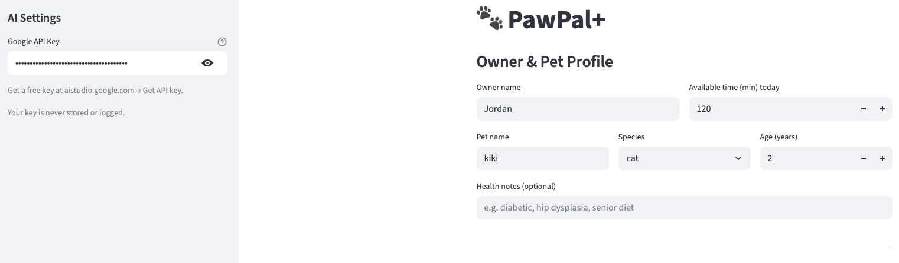</p>

**Step 2 — AI suggests tasks.** Clicking "Get AI Suggestions" sends Kiki's profile and the owner's time availability of the day to Gemini. The app displays a checkbox list of tailored care tasks with reasons. The owner reviews and selects which tasks to add.

<p align="center">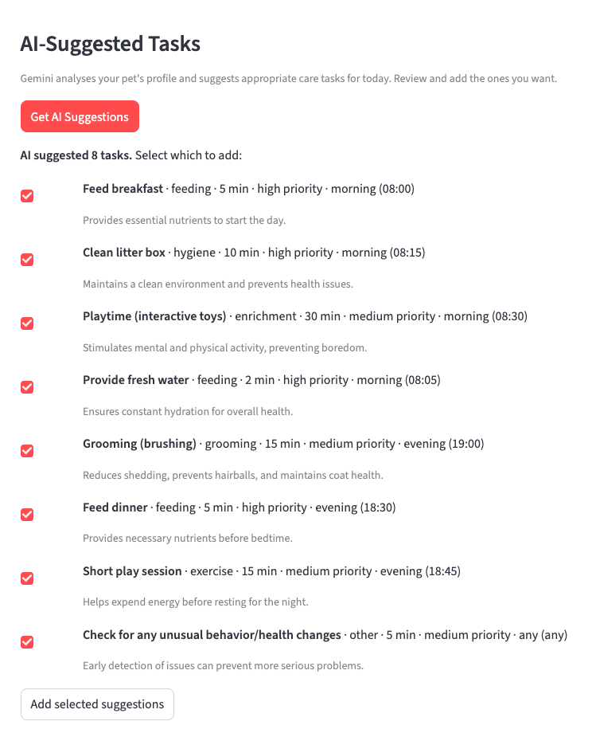</p>

**Step 3 — Tasks added to the table.** User can uncheck the tasks they don't want to add. All suggested tasks were selected and added in this test. The task table now shows each task's category, priority, duration, preferred time, and complete status, ready for scheduling.

<p align="center">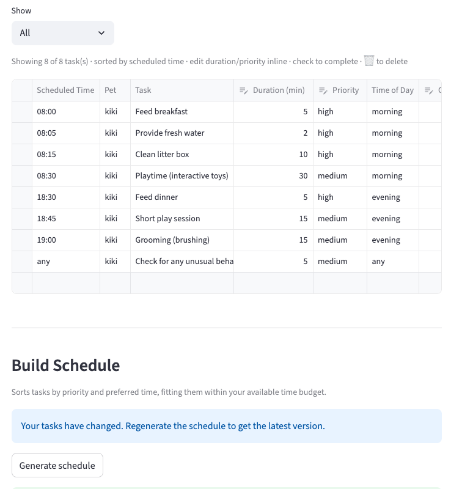</p>

**Step 4 — Schedule generated.** The greedy scheduler fits tasks within the owner's time budget, sorted by priority → preferred time → duration. The schedule panel shows which tasks were included and their per-task reasoning.

<p align="center">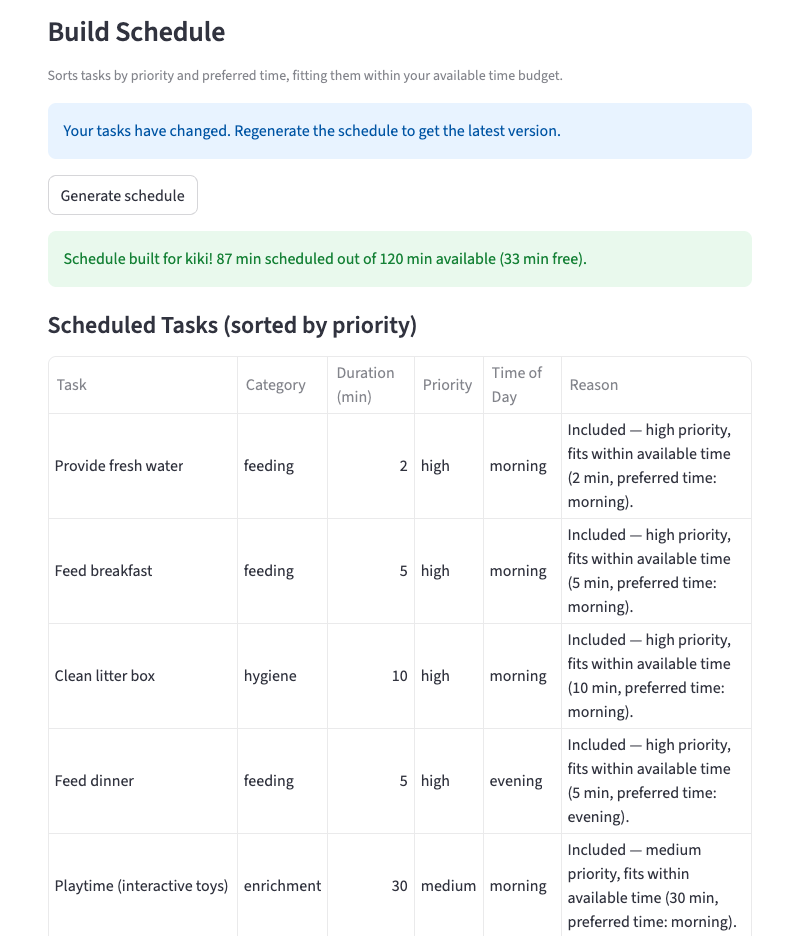</p>

**Step 5 — AI explains the plan.** Clicking "Explain plan with AI" sends the finalized schedule back to Gemini. It returns a plain-English summary of what was included and why, grounded in the actual schedule rather than a hypothetical one.

<p align="center">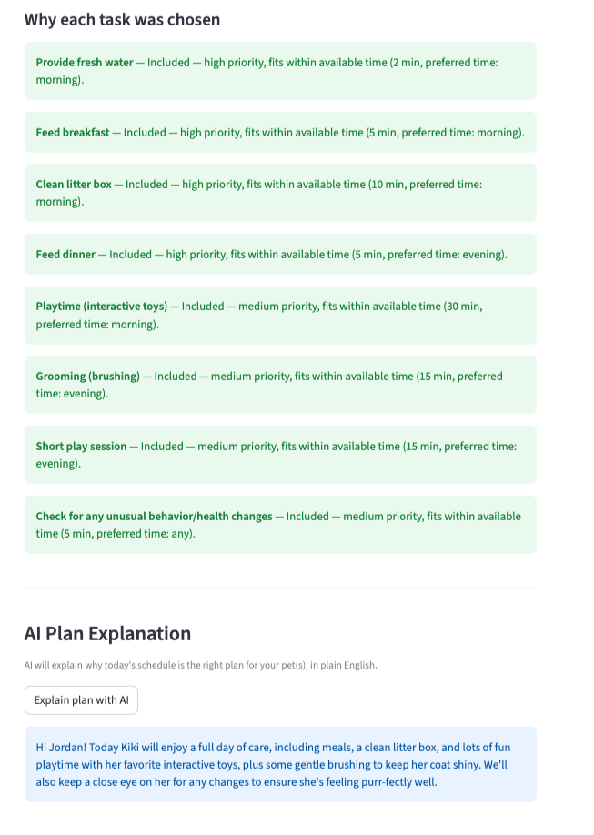</p>

---

### Example 2 — Kuri the Rabbit 🐰 (2 years old)

**Step 1 — AI suggests tasks.** Gemini analyzes Kuri's rabbit profile and returns a JSON task list. The suggested tasks reflect rabbit-specific care needs (e.g., hay, exercise, grooming) rather than generic pet tasks.

<p align="center">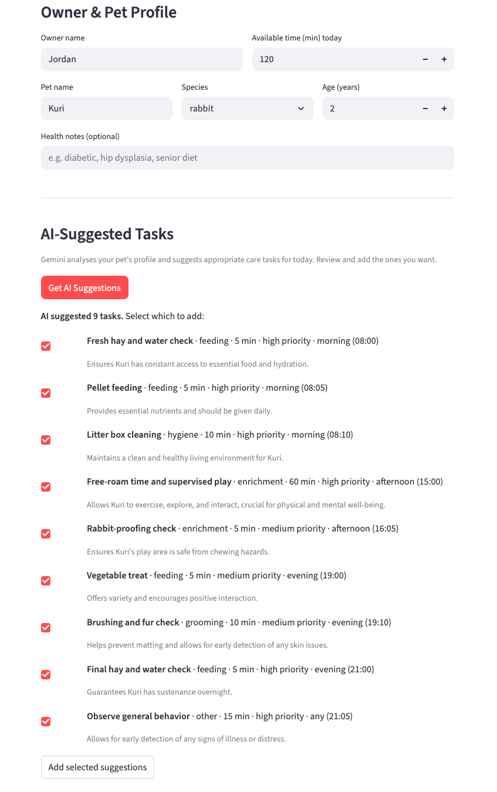</p>

**Step 2 — Tasks added to the table.** All AI-suggested tasks were accepted and added to the task table, showing the same structured fields as the manual workflow.

<p align="center">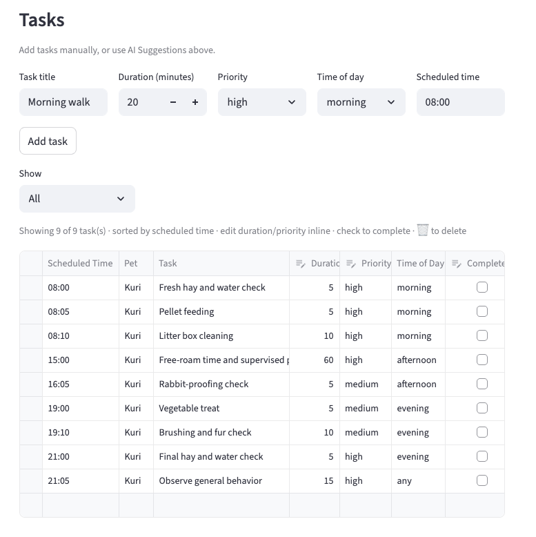</p>

**Step 3 — Schedule generated.** The scheduler produces a prioritized daily plan for Kuri. Tasks that exceed the time budget are skipped, and the reasoning column explains each scheduling decision.

<p align="center">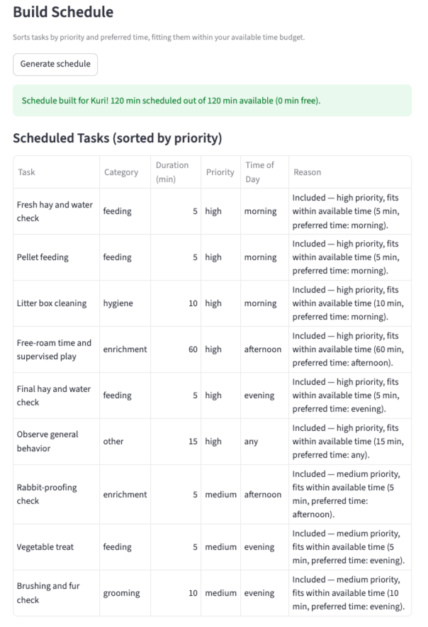</p>

**Step 4 — AI explains the plan.** Gemini reads the finalized schedule and produces a short explanation tailored to Kuri's profile, noting which tasks were prioritized and how they fit the available time.

<p align="center">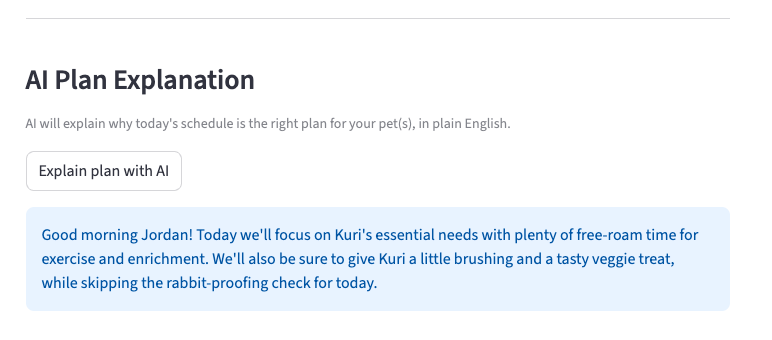</p>

---

## Design Decisions

**Agentic workflow over a single prompt.** The system separates task suggestion from schedule explanation into two distinct AI calls. This means Gemini's task suggestions pass through the deterministic scheduler before any explanation is generated — so the AI explains the actual plan the scheduler chose, not a hypothetical one. A single end-to-end prompt would blur that boundary.

**Human checkpoint between AI and scheduler.** Suggested tasks are presented as checkboxes the owner reviews before adding. This prevents Gemini's suggestions from automatically populating the schedule, keeping the owner in control of what goes into their pet's day.

**Structured JSON output for task suggestions.** `suggest_tasks()` asks Gemini to return a JSON array with a strict field schema (name, category, duration, priority, preferred_time, time, reason). This makes the response directly usable by the existing `Task` constructor without additional mapping or guesswork. The parser strips markdown code fences in case the model wraps the JSON anyway.

**Gemini 2.5 Flash Lite with `thinking_budget=0`.** The two AI calls are latency-sensitive (the user is waiting for suggestions or an explanation). Flash Lite is fast and inexpensive; disabling extended thinking removes additional latency with no meaningful quality loss for these structured tasks.

**Logging to file, not stdout.** `ai_advisor.py` writes all API calls, response lengths, and parse errors to `petnest_advisor.log`. This keeps the Streamlit UI clean while preserving a record that makes failures diagnosable without re-running the app.

**Session state, no persistence.** Task data lives in `st.session_state` and resets on page reload. Persistence (a database or file) was out of scope; the tradeoff is simplicity at the cost of continuity across sessions.

---

## Testing Summary

19 out of 19 tests pass across two test suites (`python -m pytest tests/ -v`).

**Scheduler layer (`test_petnest.py` — 13 tests):** Covers task completion, chronological sorting, daily/weekly recurrence, and conflict detection. All pass. The greedy `generate_schedule()` time-budget logic has no automated tests and was verified manually by running the app.

**AI advisor layer (`test_ai_advisor.py` — 6 tests):** Uses `unittest.mock` so no live API key is required. All pass. 

Key findings: Gemini occasionally wraps its JSON response in markdown code fences (` ```json ``` `), which the parser handles correctly. The `_validate_suggestion()` guard reliably drops tasks missing required fields or containing invalid `priority`/`preferred_time` values — in manual testing, roughly 1 in 10 suggestions had a missing or out-of-spec field, and all were filtered before reaching the UI. The `explain_schedule()` method never raises — it returns an error message string on API failure, keeping the UI stable.

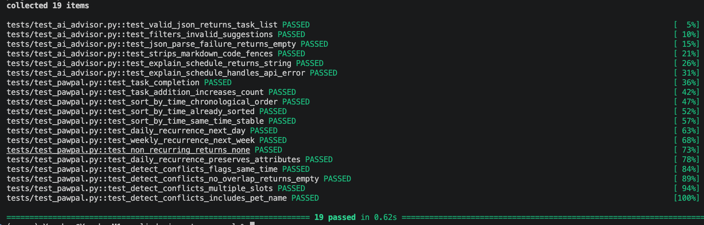

---

## Reflection

Building PetNest made clear that integrating an LLM into a real application is less about prompting and more about defensive engineering around the model's unreliability — validating structured output, logging every call, and designing the UI so a bad API response degrades gracefully rather than crashing the experience. The human-in-the-loop checkpoint (owner reviews suggestions before they enter the scheduler) turned out to be as important for correctness as it was for user control: Gemini's suggestions were useful but not unconditionally trustworthy, and the owner's review step was the last line of defense against a poorly-specified task reaching the schedule.

**What this project says about me as an AI engineer:**

When I think about what this project says about me as an AI engineer — it's not just that I integrated an AI API. It's that I thought about what happens when the AI gets it wrong. I added a validation layer, a human review checkpoint, automated tests, and graceful error handling. The AI is a collaborator in the workflow, not a black box I hand control to.

That's the approach I want to bring to any AI system I build: useful, reliable, and honest about its limits.

**For a deeper discussion of limitations, potential misuse, testing surprises, and specific instances of helpful and flawed AI collaboration during this project, see [model_card.md](model_card.md).**