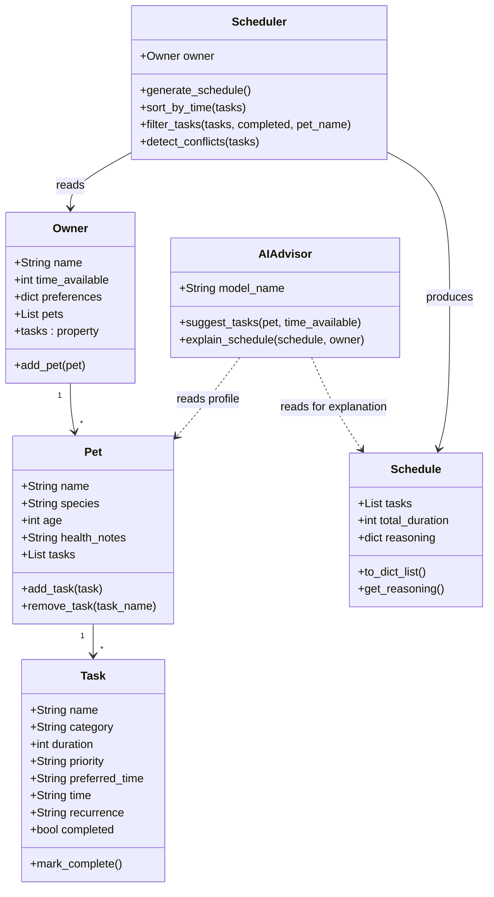

# PawPal+ AI Edition

## Original Project

**PawPal+** (Module 2) is a Streamlit app that helps a pet owner plan daily care tasks for their pet. It lets users enter owner and pet profiles, add care tasks with priority and duration, and generate a daily schedule using a greedy algorithm that sorts tasks by priority, preferred time of day, and duration, fitting them within the owner's available time budget. The original system also includes chronological sorting, completion-status filtering, scheduling conflict detection, and recurring task generation.

---

## Summary of PawPal+ AI Edition

**PawPal+ AI Edition** extends the original scheduler with an agentic AI workflow powered by Google Gemini. Instead of requiring the owner to manually create every care task from scratch, the app now lets Gemini analyze the pet's profile and suggest a tailored list of tasks, which the owner reviews before adding. After the schedule is built, Gemini explains the final plan in plain English, highlighting what was included and why. The result is a three-step human-in-the-loop workflow: AI proposes → owner decides → AI explains.

---

## Architecture Overview

The system is organized into three layers:

1. **Business logic** — `pawpal_system.py` defines five classes (`Owner`, `Pet`, `Task`, `Schedule`, `Scheduler`) that handle all scheduling, sorting, filtering, conflict detection, and recurring task logic independently of the UI.
2. **AI advisor** — `ai_advisor.py` defines `AIAdvisor`, which wraps the Gemini API. `suggest_tasks()` sends the pet's profile to Gemini and parses the JSON response into structured task dicts. `explain_schedule()` sends the finalized schedule back to Gemini for a plain-English summary.
3. **UI** — `app.py` is a Streamlit interface that wires the two layers together and holds all state in `st.session_state`.

### Agentic Workflow

```
┌──────────────────────────────────────────────────────────────────┐
│                          PawPal+ AI                              │
│                                                          TESTING │
│  [1] Owner enters pet profile + time budget                      │
│          │                                                       │
│          ▼                                                       │
│  AIAdvisor.suggest_tasks()  ──►  Gemini API                      │
│          │   returns JSON task list                              │
│          │                                                       │
│          ▼                                         ┌──────────┐  │
│  _validate_suggestion()  ◄── filters bad fields    │ logging  │  │
│          │   drops tasks missing required fields   │ (file)   │  │
│          │                                         └──────────┘  │
│          ▼                                                       │
│  Owner reviews & selects tasks  (human checkpoint)               │
│          │                                                       │
│          ▼                                                       │
│  Scheduler.generate_schedule()  (greedy fit)        ┌─────────┐  │
│          │   priority → time preference → duration  │ unit    │  │
│          │  ◄─────────────────────────────────────  │ tests   │  │
│          ▼                                          │ (pytest)│  │
│  Schedule displayed with per-task reasoning         └─────────┘  │
│          │                                                       │
│          ▼                                                       │
│  AIAdvisor.explain_schedule()  ──►  Gemini API                   │
│          │   returns plain-English explanation                   │
│          │                                          ┌──────────┐ │
│          │  ◄─────────────────────────────────────  │ mocked   │ │
│          ▼                                          │ API tests│ │
│  Owner reads explanation                            └──────────┘ │
└──────────────────────────────────────────────────────────────────┘
```

**Testing layer key:**
- **Unit tests (pytest)** — 13 tests validate `Scheduler` logic (sorting, recurrence, conflict detection). Run with `python -m pytest tests/test_pawpal.py -v`.
- **Mocked API tests** — `tests/test_ai_advisor.py` uses `unittest.mock` to test `AIAdvisor` without a live key: valid JSON parsing, field validation filtering, code-fence stripping, and graceful error handling.
- **`_validate_suggestion()` (runtime guard)** — integrated into `suggest_tasks()`, filters out any AI-returned task missing required fields or containing invalid enum values before they reach the UI.
- **File logging** — `ai_advisor.py` writes every call, response length, parse error, and validation rejection to `pawpal_advisor.log`.

### Class Diagram



---

## Setup Instructions

**Requirements:** Python 3.9+, a free Google Gemini API key from [aistudio.google.com](https://aistudio.google.com).

```bash
# 1. Clone the repo
git clone https://github.com/lorraineC26/applied-ai-system-pawpal.git
cd applied-ai-system-pawpal

# 2. Create and activate a virtual environment
python -m venv .venv
source .venv/bin/activate        # Windows: .venv\Scripts\activate

# 3. Install dependencies
pip install -r requirements.txt

# 4. Run the app
streamlit run app.py
```

When the app opens, paste your Gemini API key in the **AI Settings** sidebar. The scheduler works without a key; AI suggestions and plan explanations require it.

**Run tests:**
```bash
python -m pytest tests/test_pawpal.py -v
```

---

## Sample Interactions

<!-- TODO: Fill in after Phase 2 testing with real Gemini outputs.
     Include at least 3 examples:
     - Example 1: AI task suggestions for a dog profile
     - Example 2: Scheduler output with skipped tasks
     - Example 3: AI plan explanation for a cat with health notes
-->

---

## Design Decisions

**Agentic workflow over a single prompt.** The system separates task suggestion from schedule explanation into two distinct AI calls. This means Gemini's task suggestions pass through the deterministic scheduler before any explanation is generated — so the AI explains the actual plan the scheduler chose, not a hypothetical one. A single end-to-end prompt would blur that boundary.

**Human checkpoint between AI and scheduler.** Suggested tasks are presented as checkboxes the owner reviews before adding. This prevents Gemini's suggestions from automatically populating the schedule, keeping the owner in control of what goes into their pet's day.

**Structured JSON output for task suggestions.** `suggest_tasks()` asks Gemini to return a JSON array with a strict field schema (name, category, duration, priority, preferred_time, time, reason). This makes the response directly usable by the existing `Task` constructor without additional mapping or guesswork. The parser strips markdown code fences in case the model wraps the JSON anyway.

**Gemini 2.5 Flash Lite with `thinking_budget=0`.** The two AI calls are latency-sensitive (the user is waiting for suggestions or an explanation). Flash Lite is fast and inexpensive; disabling extended thinking removes additional latency with no meaningful quality loss for these structured tasks.

**Logging to file, not stdout.** `ai_advisor.py` writes all API calls, response lengths, and parse errors to `pawpal_advisor.log`. This keeps the Streamlit UI clean while preserving a record that makes failures diagnosable without re-running the app.

**Session state, no persistence.** Task data lives in `st.session_state` and resets on page reload. Persistence (a database or file) was out of scope; the tradeoff is simplicity at the cost of continuity across sessions.

---

## Testing Summary

<!-- TODO: Fill in after running reliability/evaluation tests.
     Structure:
     - How many AI suggestion calls were tested?
     - Did Gemini reliably return valid JSON? What edge cases broke it?
     - Did the explain_schedule output stay accurate when tasks were skipped?
     - Confidence scores or pass/fail counts if applicable.
-->

**Unit tests (existing):** 13 tests cover task completion, chronological sorting, recurrence (daily/weekly/none), and conflict detection. All 13 pass.

```
python -m pytest tests/test_pawpal.py -v
# 13 passed
```

**What is not covered:** `generate_schedule()` time-budget enforcement has no automated tests. `AIAdvisor` methods are not unit-tested (they require a live API key); reliability was evaluated manually.

---

## Reflection

<!-- TODO: Fill in after project completion. Address:
     - What are the limitations or biases in your system?
     - Could your AI be misused, and how would you prevent that?
     - What surprised you while testing your AI's reliability?
     - One instance where AI gave a helpful suggestion; one where it was flawed.
-->
