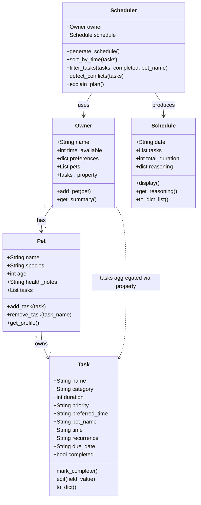

# PawPal+ Project Reflection

## 1. System Design

**Three Core Actions**
1. Enter owner and pet info — Input basic profile information about the owner and their pet to personalize the experience.

2. Add and edit care tasks — Create and modify tasks (walks, feeding, meds, grooming, etc.) with at minimum a duration and priority level.

3. Generate a daily schedule — Produce a care plan based on constraints and priorities, with an explanation of why the plan was structured that way.

**a. Initial design**

- Briefly describe your initial UML design.

The initial design contains five classes: `Owner`, `Pet`, `Task`, `Schedule`, and `Scheduler`. `Owner` holds the owner's name and available time, and is associated with one `Pet` and a list of `Task` objects. `Pet` holds profile attributes such as name, species, age, and health notes. `Task` holds the details of a single care activity — name, category, duration, and priority. `Scheduler` takes an `Owner`, `Pet`, and list of `Tasks` as inputs and produces a `Schedule`, which stores an ordered list of tasks, the total duration, and a plain-language explanation of the plan.

- What classes did you include, and what responsibilities did you assign to each?

Five classes were included: `Owner` stores the owner's profile and available daily time; `Pet` stores the pet's profile and health notes; `Task` represents a single care activity with a duration and priority; `Schedule` holds the ordered plan output and its reasoning; and `Scheduler` contains all planning logic — it takes the owner, pet, and tasks as input and produces a `Schedule` based on priority and time constraints.

**Class Diagram**

**b. Design changes**

- Did your design change during implementation?
- If yes, describe at least one change and why you made it.

  Yes. The initial UML showed two relationships — `Owner "1"-->"1" Pet` and `Owner "1"-->"*" Task` — but the original `Owner.__init__` never initialized `self.pet` or `self.tasks`. This meant `add_pet()` had no place to store the pet, and `Scheduler` had no way to reach task or pet data without breaking out of the design. To fix this, `self.pet = None` and `self.tasks = []` were added to `Owner.__init__`, making `Owner` the single source of truth that `Scheduler` reads through. This also revealed a bottleneck: routing all data through `Owner` turns it into a data hub rather than just a profile class. A future iteration might give `Scheduler` direct references to `pet` and `tasks` instead.

---

## 2. Scheduling Logic and Tradeoffs

**a. Constraints and priorities**

- What constraints does your scheduler consider (for example: time, priority, preferences)?
- How did you decide which constraints mattered most?

  The scheduler considers three constraints: **time budget** (the owner's total available minutes per day), **task priority** (high / medium / low), and **time-of-day preference** (morning, afternoon, evening, or any — with an optional `prefer_morning` flag that promotes morning tasks further).

  Priority was treated as most important because high-priority tasks tend to be health-critical (medication, feeding), so skipping them carries real consequences. Time budget is a hard constraint, a task either fits or it doesn't, so it acts as a gate after priority sorting. Time-of-day preference is the softest constraint: it shapes the order of same-priority tasks but never excludes a task on its own. This hierarchy (priority → time budget → time preference) reflects a simple rule: do the most important things first, as early as the owner prefers, and stop when time runs out.

**b. Tradeoffs**

- Describe one tradeoff your scheduler makes.
- Why is that tradeoff reasonable for this scenario?

  The scheduler uses a greedy first-fit strategy: it works through the priority-sorted task list and includes each task if it fits within the remaining time budget, skipping it otherwise. This means a long high-priority task early in the list can consume enough time to crowd out several shorter tasks that follow, even if those shorter tasks would collectively be a better use of the remaining minutes.

  This tradeoff is reasonable for a daily pet care app because simplicity and predictability matter more than perfect optimization. Owners can read the reasoning output and manually adjust task durations or priorities if the plan feels off. A more complex algorithm (such as dynamic programming to maximize tasks scheduled) would be harder to explain and harder to trust, which matters in a care context where the owner needs to understand and verify the plan.

---

## 3. AI Collaboration

**a. How you used AI**

- How did you use AI tools during this project (for example: design brainstorming, debugging, refactoring)?

  I used AI tools across several phases of the project:
    1. **Design brainstorming:** I used AI to iterate on the initial UML class diagram — asking it to critique the relationships between `Owner`, `Pet`, `Task`, `Schedule`, and `Scheduler` before writing any code. This surfaced the missing `self.pet` and `self.tasks` initializations in `Owner.__init__` before they caused runtime failures.

    2. **Debugging:** When `Scheduler` couldn't reach task or pet data through `Owner`, I described the broken data flow to the AI and used its explanation to trace the root cause back to the design gap rather than patching the symptom.

    3. **Feature implementation:** For new capabilities — recurring tasks with timedelta advancement, conflict detection grouped by time slot, and the composite sort key (priority → time preference → duration) — I prompted AI with the behavioral spec and then reviewed and adjusted the generated code to fit the existing class contracts.

    4. **Test writing:** I described the behaviors I wanted covered (sort stability, recurrence spawning, conflict grouping) and used AI-generated test stubs as a starting point, editing them to match actual attribute names and expected values in the codebase.

    5. **Refactoring the Streamlit UI:** When adding multi-pet support to `app.py`, I asked AI to restructure the session-state logic and then verified the result manually by running the app.

- What kinds of prompts or questions were most helpful?

  The most effective prompts were specific and behavioral rather than open-ended. Asking "given this class design, what data does `Scheduler` need to reach and what's missing?" produced actionable critique. For implementation, prompts like "write a method that groups tasks by their `time` field and returns a warning string for each group with more than one task" worked better than vague requests like "add conflict detection." For debugging, describing the exact symptom and sharing the relevant code snippet — rather than asking "why doesn't this work?" — consistently led to faster, more accurate diagnosis. In general, prompts that included context (the existing class contract, the expected behavior, and what I had already tried) were more useful than asking for solutions from scratch.

**b. Judgment and verification**

- Describe one moment where you did not accept an AI suggestion as-is.
- How did you evaluate or verify what the AI suggested?

  When I asked AI to generate the `sort_by_time` method, it initially suggested parsing each task's `time` string with `datetime.strptime` before comparing. I evaluated this by reading the existing `Task` class and checking how `time` values were actually stored — they are always zero-padded `HH:MM` strings, which sort correctly as plain strings without any parsing. To verify, I manually traced through a few representative values (`"08:00"`, `"13:30"`, `"18:00"`) and confirmed that lexicographic order matched chronological order in every case. I also checked whether any code path could produce a missing or malformed `time` value, which would have caused `strptime` to raise an exception. Satisfied that the simpler approach was safe for this data contract, I replaced the AI's suggestion with a direct string comparison. The existing tests for `sort_by_time` then confirmed the behavior held under the expected inputs.

---

## 4. Testing and Verification

**a. What you tested**

- What behaviors did you test?
- Why were these tests important?

  The test suite covers three behavioral areas across 13 tests:

  1. **Task lifecycle** — `test_task_completion` verifies that `mark_complete()` flips the `completed` flag, and `test_task_addition_increases_count` confirms that `add_task()` correctly appends to a pet's task list. These are the most fundamental operations; if they break, nothing else in the app functions correctly.

  2. **Sorting correctness** — Four tests check `sort_by_time`: chronological ordering of mixed times, stability on already-sorted input, and handling of ties (two tasks at the same `HH:MM`). These matter because the schedule's readability depends entirely on tasks appearing in the right order — a silent sort bug would produce a confusing plan without raising any error.

  3. **Recurrence logic** — Four tests cover `mark_complete()` on recurring tasks: daily recurrence advances `due_date` by one day, weekly by seven days, non-recurring returns `None`, and the spawned task preserves all original attributes (category, duration, priority, pet name, time, completed=False). Recurrence is the most stateful feature in the system — an off-by-one in the timedelta or a missing attribute on the new task would silently corrupt the owner's ongoing care plan.

  4. **Conflict detection** — Four tests verify `detect_conflicts`: two tasks at the same time produce one `WARNING` string containing the time slot, distinct times return an empty list, multiple conflicting slots each get their own warning, and warnings include pet names when present. Conflict detection is a safety feature — if it misses overlaps or crashes on edge cases, the owner gets no signal that their schedule is impossible.

**b. Confidence**

- How confident are you that your scheduler works correctly?
- What edge cases would you test next if you had more time?

  I'm moderately confident in the three areas covered by tests — sorting, recurrence, and conflict detection all behave correctly on the tested inputs. I'm less confident in `generate_schedule()` itself, which has no automated tests. The time-budget enforcement (the core greedy logic) has only been verified by running the app manually. There is also a known bug in `explain_plan()`: it references `self.owner.pet` (singular, nonexistent) instead of iterating over `self.owner.pets`, so it would crash for any owner with multiple pets. That hasn't surfaced in normal use only because the method isn't called from the main scheduling path.

  Edge cases I would test next:

  - **Empty task list** — `generate_schedule()` and `detect_conflicts()` should return gracefully with an empty schedule and no warnings, not crash.
  - **Time budget exactly met** — a task whose duration equals the remaining budget exactly should be included; one minute over should be excluded. This boundary is easy to get wrong in the greedy loop.
  - **Task with no `time` field** — `sort_by_time` sorts on an empty string `""`, which sorts before any `HH:MM` value. Whether that's the intended behavior for unscheduled tasks should be an explicit decision, not an accident.
  - **Owner with zero time available** — `generate_schedule()` should produce an empty schedule with all tasks marked as skipped, not silently include any tasks.
  - **Recurring task with no `due_date`** — `mark_complete()` advances `due_date` using `timedelta`, but if `due_date` is `None` (never set), it would raise a `TypeError`. This is a realistic input since `due_date` is optional.

---

## 5. Reflection

**a. What went well**

- What part of this project are you most satisfied with?

  The part I'm most satisfied with is the conflict detection and its test coverage. `detect_conflicts()` is a small, focused method. It groups tasks by time slot and emits a warning string for each conflict, but getting it right required thinking carefully about the data shape, the output format, and the edge cases (multiple slots, pet names in warnings, empty input). Writing four targeted tests that each pin down one specific behavior made it easy to confirm the method was correct and gave me real confidence when connecting it to the UI. It's a good example of a feature where the design, implementation, and verification all fit together cleanly.

**b. What you would improve**

- If you had another iteration, what would you improve or redesign?

  I would redesign how `Scheduler` accesses data. Currently, `Owner` acts as a data hub — `Scheduler` reaches pets and tasks by navigating through `owner.pets` — which means `Scheduler` is tightly coupled to `Owner`'s internal structure. If `Owner` changes (say, tasks move to a separate store), `Scheduler` breaks. A cleaner design would pass `pets` and `tasks` directly into `generate_schedule()` as arguments, making the scheduler a pure function of its inputs and easier to test in isolation without constructing a full `Owner` object every time.

  I would also fix the `explain_plan()` bug (referencing the nonexistent `self.owner.pet`) and add at least a few tests for `generate_schedule()` itself — specifically for the time-budget boundary and the priority ordering — since that's the core feature with the least verification.

**c. Key takeaway**

- What is one important thing you learned about designing systems or working with AI on this project?

  The most important thing I learned is that a design gap on paper becomes a runtime bug in code almost immediately. The initial UML had `Owner` associated with `Pet` and `Task`, but `Owner.__init__` never actually initialized those fields — the diagram looked complete, but the code had nothing to hold the data. That mismatch surfaced the moment `Scheduler` tried to read through `Owner`. It taught me to treat the class diagram not as a finished plan but as a hypothesis to test against the code: if a relationship exists in the diagram, the corresponding attribute must exist in `__init__`, or the design is not actually implemented yet.

  On the AI side, I learned that AI is most useful as a fast first draft, not a final answer. It can generate a plausible method quickly, but it doesn't know the specific constraints of your data — like the fact that `time` is always a zero-padded `HH:MM` string. Verifying AI output against the actual code, tracing through real values, and confirming with tests is what turns a plausible suggestion into something you can trust.
