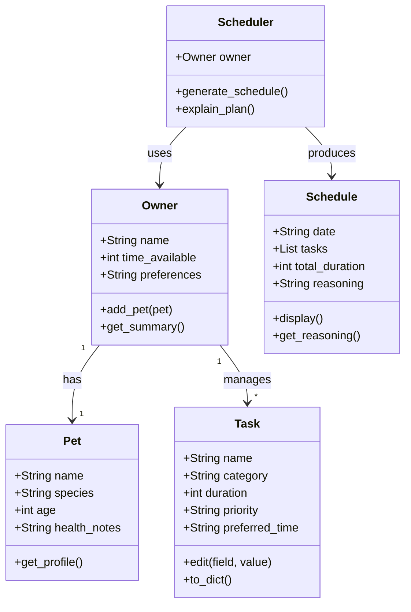

# PawPal+ Project Reflection

## 1. System Design

**Three Core Actions**
1. Enter owner and pet info — Input basic profile information about the owner and their pet to personalize the experience.

2. Add and edit care tasks — Create and modify tasks (walks, feeding, meds, grooming, etc.) with at minimum a duration and priority level.

3. Generate a daily schedule — Produce a care plan based on constraints and priorities, with an explanation of why the plan was structured that way.

**a. Initial design**

- Briefly describe your initial UML design.

The initial design contains five classes: `Owner`, `Pet`, `Task`, `Schedule`, and `Scheduler`. `Owner` holds the owner's name and available time, and is associated with one `Pet` and a list of `Task` objects. `Pet` holds profile attributes such as name, species, age, and health notes. `Task` holds the details of a single care activity — name, category, duration, and priority. `Scheduler` takes an `Owner`, `Pet`, and list of `Tasks` as inputs and produces a `Schedule`, which stores an ordered list of tasks, the total duration, and a plain-language explanation of the plan.

- What classes did you include, and what responsibilities did you assign to each?

Five classes were included: `Owner` stores the owner's profile and available daily time; `Pet` stores the pet's profile and health notes; `Task` represents a single care activity with a duration and priority; `Schedule` holds the ordered plan output and its reasoning; and `Scheduler` contains all planning logic — it takes the owner, pet, and tasks as input and produces a `Schedule` based on priority and time constraints.

**Class Diagram**

**b. Design changes**

- Did your design change during implementation?
- If yes, describe at least one change and why you made it.

Yes. The initial UML showed two relationships — `Owner "1"-->"1" Pet` and `Owner "1"-->"*" Task` — but the original `Owner.__init__` never initialized `self.pet` or `self.tasks`. This meant `add_pet()` had no place to store the pet, and `Scheduler` had no way to reach task or pet data without breaking out of the design. To fix this, `self.pet = None` and `self.tasks = []` were added to `Owner.__init__`, making `Owner` the single source of truth that `Scheduler` reads through. This also revealed a bottleneck: routing all data through `Owner` turns it into a data hub rather than just a profile class. A future iteration might give `Scheduler` direct references to `pet` and `tasks` instead.

---

## 2. Scheduling Logic and Tradeoffs

**a. Constraints and priorities**

- What constraints does your scheduler consider (for example: time, priority, preferences)?
- How did you decide which constraints mattered most?

The scheduler considers three constraints: **time budget** (the owner's total available minutes per day), **task priority** (high / medium / low), and **time-of-day preference** (morning, afternoon, evening, or any — with an optional `prefer_morning` flag that promotes morning tasks further).

Priority was treated as most important because high-priority tasks tend to be health-critical (medication, feeding), so skipping them carries real consequences. Time budget is a hard constraint, a task either fits or it doesn't, so it acts as a gate after priority sorting. Time-of-day preference is the softest constraint: it shapes the order of same-priority tasks but never excludes a task on its own. This hierarchy (priority → time budget → time preference) reflects a simple rule: do the most important things first, as early as the owner prefers, and stop when time runs out.

**b. Tradeoffs**

- Describe one tradeoff your scheduler makes.
- Why is that tradeoff reasonable for this scenario?

The scheduler uses a greedy first-fit strategy: it works through the priority-sorted task list and includes each task if it fits within the remaining time budget, skipping it otherwise. This means a long high-priority task early in the list can consume enough time to crowd out several shorter tasks that follow, even if those shorter tasks would collectively be a better use of the remaining minutes.

This tradeoff is reasonable for a daily pet care app because simplicity and predictability matter more than perfect optimization. Owners can read the reasoning output and manually adjust task durations or priorities if the plan feels off. A more complex algorithm (such as dynamic programming to maximize tasks scheduled) would be harder to explain and harder to trust, which matters in a care context where the owner needs to understand and verify the plan.

---

## 3. AI Collaboration

**a. How you used AI**

- How did you use AI tools during this project (for example: design brainstorming, debugging, refactoring)?
- What kinds of prompts or questions were most helpful?

**b. Judgment and verification**

- Describe one moment where you did not accept an AI suggestion as-is.
- How did you evaluate or verify what the AI suggested?

---

## 4. Testing and Verification

**a. What you tested**

- What behaviors did you test?
- Why were these tests important?

**b. Confidence**

- How confident are you that your scheduler works correctly?
- What edge cases would you test next if you had more time?

---

## 5. Reflection

**a. What went well**

- What part of this project are you most satisfied with?

**b. What you would improve**

- If you had another iteration, what would you improve or redesign?

**c. Key takeaway**

- What is one important thing you learned about designing systems or working with AI on this project?
